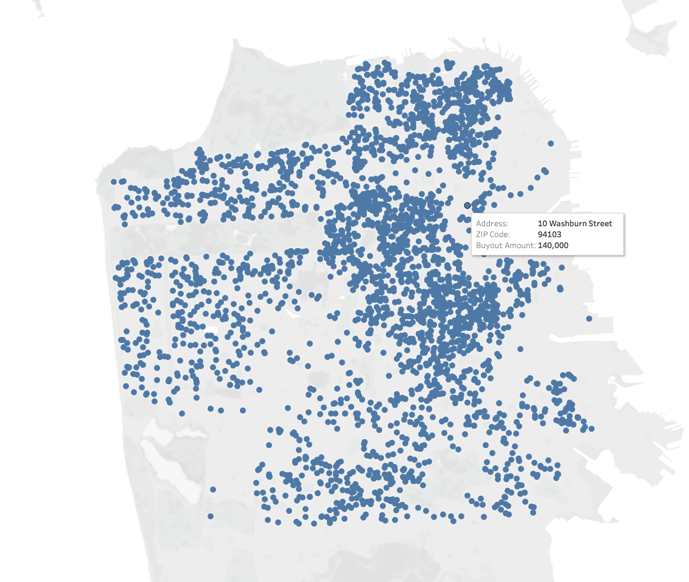
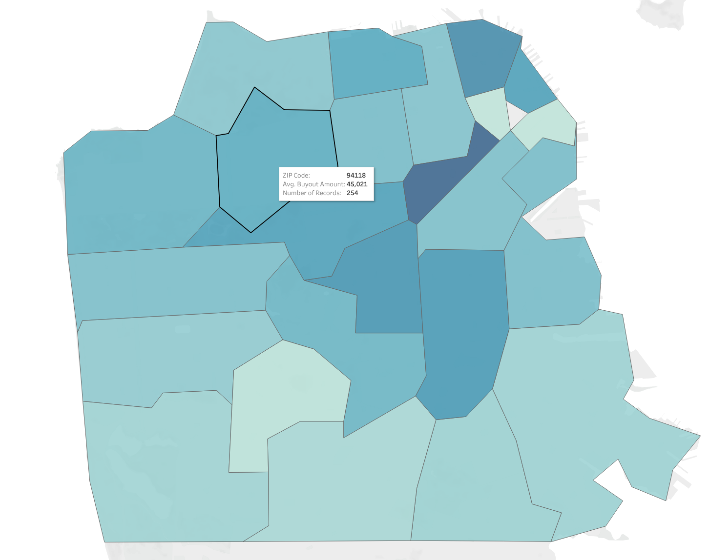
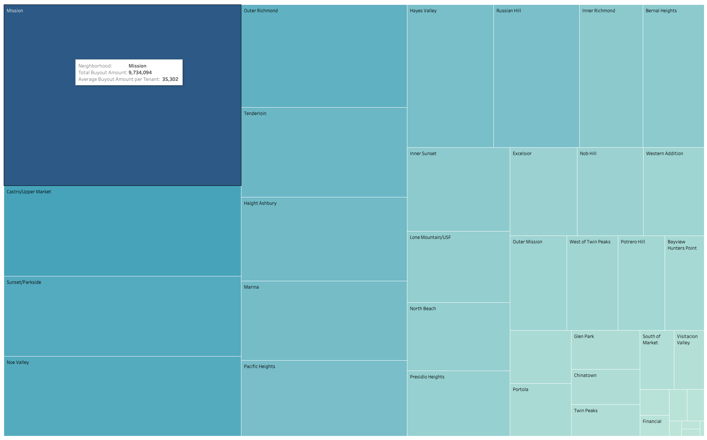
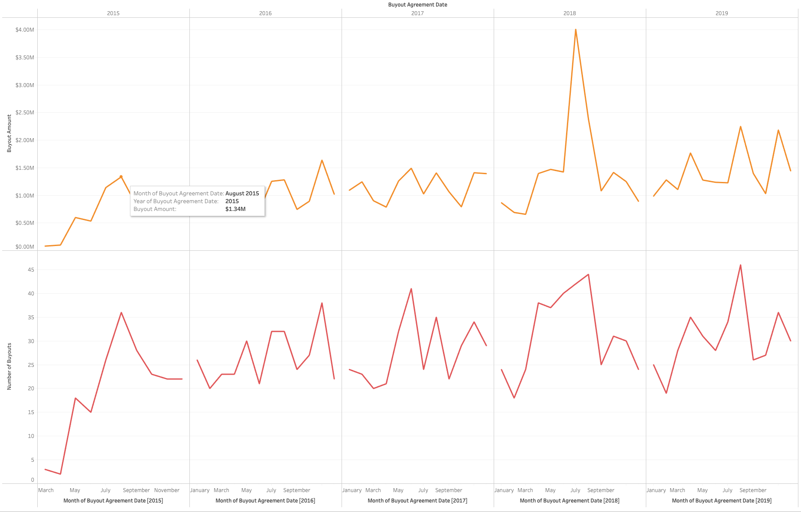

## Maps

The intention is to perhaps merge the two maps and be able to display each buyout agreement that occured in the San Francisco for the past five years. The questions I am trying to explore:

### Interactivity

On-demand details for _each buyout point_ displaying address, buyout amount, number of tenants, how it compares to average buyout amount in the zip and how it compares to average buyout amount for the entire city.

1. Where are the buyouts happening, which areas of the city? _Answer_: The central parts of the city and Mission district
3. How does the buyout compare to others? _Answer_: Depends 

#### Symbol Map, San Francisco Rental Buyouts

 

#### Clotopleth Map, San Francisco Rental Buyouts per Zip

 

## Tree

The tree map breaks down the data by neighborhood. The questions I am trying to explore:

1. What city neighborhoods have the highest cumulative buyout amount? Mission, Outer Richmond, Castro/Upper Market & Tenderloin
2. How neighborhoods compare to one another in terms of buyouts? _Answer_: Depends

### Interactivity

Finally, I am thinking of including a linechart per each neighborhood. The line chart would be an interactive piece of the treemap - when a neighborhood is hovered, I would display a time chart of buyout trends. The questions I am trying to explore:

1. What are the buyout trends for the specific neighborhood? _Answer_: Depends
2. How are the buyout amounts changing? _Answer_: Depends
3. How is the number of buyouts changing? _Answer_: Depends

Note: This prototype is across the entire dataset
#### Tree Map, San Francisco Rental Buyouts per Neighborhood

#### Line Chart, San Francisco Buyouts month-to-month (2015-2019)
 

Source: [data.sfgov.org](https://data.sfgov.org/Housing-and-Buildings/Map-of-Buyout-Agreements/aa2m-ehxd)